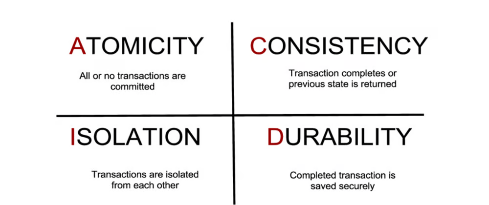

# Table of Contents

1. [ACID Principles](#acid-principles)
   - [Atomicity](#atomicity)
   - [Consistency](#consistency)
   - [Isolation](#isolation)
   - [Durability](#durability)
2. [Normalization](#normalization)
   - [What is Normalization?](#what-is-normalization)
   - [Why Do We Need Normalization?](#why-do-we-need-normalization)
   - [Unnormalized Form (UNF)](#unnormalized-form-unf)
   - [First Normal Form (1NF)](#first-normal-form-1nf)
   - [Second Normal Form (2NF)](#second-normal-form-2nf)
   - [Third Normal Form (3NF)](#third-normal-form-3nf)

# ACID Principles

ACID is a set of properties that guarantee that database transactions are processed reliably and ensure the integrity of the database. The acronym ACID stands for:

1. Atomicity
2. Consistency
3. Isolation
4. Durability

### Atomicity

Atomicity means that a transaction is an indivisible unit of work. Either all the operations within a transaction are completed successfully, or none of them are applied. In other words, the transaction is "atomic" like an atom.

By this, we mean that either the entire transaction takes place at once or doesn’t happen at all. There is no midway i.e. transactions do not occur partially. Each transaction is considered as one unit and either runs to completion or is not executed at all. It involves the following two operations.
- **Abort:** If a transaction aborts, changes made to the database are not visible.
- **Commit:** If a transaction commits, changes made are visible.

Atomicity is also known as the ‘All or nothing rule’.

Consider the following transaction **T** consisting of **T1** and **T2**: Transfer of 100 from account **X** to account **Y**.

If the transaction fails after completion of **T1** but before completion of **T2** (say, after **write(X)** but before **write(Y)**), then the amount has been deducted from **X** but not added to **Y**. This results in an inconsistent database state. Therefore, the transaction must be executed in its entirety in order to ensure the correctness of the database state.

#### Example

Imagine you’re transferring $100 from Account A to Account B. This transaction involves two operations: deducting $100 from Account A and adding $100 to Account B. Atomicity ensures that either both operations succeed, or neither does. If there’s a system failure after the deduction but before the addition, the transaction is *rolled back*, and the system ensures that Account A is not debited without Credit to Account B.

[Back to Top](#table-of-contents)

### Consistency

This means that integrity constraints must be maintained so that the database is consistent before and after the transaction. It refers to the correctness of a database. Referring to the example above, the total amount before and after the transaction must be maintained.
- Total before T occurs = 500 + 200 = 700
- Total after T occurs = 400 + 300 = 700

Therefore, the database is consistent. Inconsistency occurs in case T1 completes but T2 fails. As a result, T is incomplete.

### Isolation

This property ensures that multiple transactions can occur concurrently without leading to the inconsistency of the database state. Transactions occur independently without interference. Changes occurring in a particular transaction will not be visible to any other transaction until that particular change in that transaction is written to memory or has been committed. This property ensures that the execution of transactions concurrently will result in a state that is equivalent to a state achieved if they were executed serially in some order.

Let **X** = 500, **Y** = 500. Consider two transactions **T** and **T’’**.

Suppose **T** has been executed till **Read(Y)** and then **T’’** starts. As a result, interleaving of operations takes place due to which **T’’** reads the correct value of **X** but the incorrect value of **Y** and sum computed by **T’’: (X+Y = 50,000+500=50,500)** is thus not consistent with the sum at the end of the transaction: **T: (X+Y = 50,000 + 450 = 50,450)**. This results in database inconsistency, due to a loss of 50 units. Hence, transactions must take place in isolation and changes should be visible only after they have been made to the main memory.

[Back to Top](#table-of-contents)

### Durability

Imagine you are transferring $100 from Account A to Account B in a bank’s database. This transaction involves the following steps:

1. **Debit $100 from Account A**
2. **Credit $100 to Account B**

#### How Durability Works

1. **Transaction Execution:**
    - The transaction begins and successfully deducts $100 from Account A.
    - The transaction then adds $100 to Account B.

2. **Commit Phase:**
    - After these operations are completed, the transaction is committed. This means that the database confirms that all the operations in the transaction have been successfully completed and are now permanent.

3. **Durability in Action:**
    - Suppose the system crashes immediately after the commit but before any data is written to disk.
    - Due to durability, when the system restarts, the database will ensure that the $100 has indeed been deducted from Account A and added to Account B. The committed changes are not lost despite the crash.

#### How This Ensures Durability

- **Write-Ahead Logging:** Databases typically use a write-ahead log (WAL) to ensure durability. Before any changes are written to the database, they are first recorded in the WAL. If a crash occurs, the database can use the WAL to recover committed transactions.
    
- **Atomic Commit Protocols:** Some databases use atomic commit protocols to ensure that the commit operation is fully completed and cannot be partially executed. This guarantees that once a transaction is committed, it is permanent and will not be undone.

[Back to Top](#table-of-contents)
# Normalization

## What is Normalization?

Normalization is a process in database design that organizes tables and their relationships to reduce redundancy and improve data integrity. The primary goal of normalization is to ensure that the database structure is efficient and minimizes the chances of anomalies (inconsistencies, update anomalies, and other issues).

## Why Do We Need Normalization?

1. **Reduces Data Redundancy:** Eliminates duplicate data, which saves storage space and minimizes the risk of inconsistent data.
2. **Improves Data Integrity:** Ensures that the data is accurate and consistent by organizing it into appropriate tables and relationships.
3. **Facilitates Efficient Data Retrieval:** Optimizes queries and improves the efficiency of data retrieval and updates.
4. **Simplifies Database Maintenance:** Makes it easier to maintain and update the database by ensuring that changes only need to be made in one place.

## Unnormalized Form (UNF)

**Definition:** The unnormalized form is a table that has not yet been processed to remove redundancy and anomalies.

**Example:**

**EmployeeDetails**

| EmployeeID | Name    | Department | Projects                  |
|------------|---------|------------|---------------------------|
| 1          | Alice   | HR         | Recruitment, Onboarding   |
| 2          | Bob     | IT         | System Design, Development|
| 3          | Charlie | IT         | System Design             |
| 4          | David   | HR         | Recruitment               |

In this table, the `Projects` column contains multiple values, violating the atomicity requirement of 1NF.

[Back to Top](#table-of-contents)

## First Normal Form (1NF)

**Definition:** A table is in 1NF if it contains only atomic (indivisible) values and each column contains only one type of value.

**Example:**

To achieve 1NF, split the `Projects` column into separate rows:

**EmployeeDetails (1NF)**

| EmployeeID | Name    | Department | Project         |
|------------|---------|------------|-----------------|
| 1          | Alice   | HR         | Recruitment     |
| 1          | Alice   | HR         | Onboarding      |
| 2          | Bob     | IT         | System Design   |
| 2          | Bob     | IT         | Development     |
| 3          | Charlie | IT         | System Design   |
| 4          | David   | HR         | Recruitment     |

[Back to Top](#table-of-contents)
## Second Normal Form (2NF)

**Definition:** A table is in 2NF if it is in 1NF and all non-key attributes are fully functionally dependent on the entire primary key. This removes partial dependencies.

**Example:**

To achieve 2NF, split the data into two tables:

**Employee Table (2NF)**

| EmployeeID | Name    | Department |
|------------|---------|------------|
| 1          | Alice   | HR         |
| 2          | Bob     | IT         |
| 3          | Charlie | IT         |
| 4          | David   | HR         |

**ProjectAssignments Table (2NF)**

| EmployeeID | Project         |
|------------|-----------------|
| 1          | Recruitment     |
| 1          | Onboarding      |
| 2          | System Design   |
| 2          | Development     |
| 3          | System Design   |
| 4          | Recruitment     |

[Back to Top](#table-of-contents)
## Third Normal Form (3NF)

**Definition:** A table is in 3NF if it is in 2NF and all the attributes are functionally dependent only on the primary key and not on other non-key attributes (i.e., there are no transitive dependencies).

**Example:**

To achieve 3NF, separate department information:

**Departments Table (3NF)**

| DepartmentID | DepartmentName |
|--------------|----------------|
| 1            | HR             |
| 2            | IT             |

**Employee Table (3NF)**

| EmployeeID | Name    | DepartmentID |
|------------|---------|--------------|
| 1          | Alice   | 1            |
| 2          | Bob     | 2            |
| 3          | Charlie | 2            |
| 4          | David   | 1            |

**ProjectAssignments Table (3NF)**

| EmployeeID | Project         |
|------------|-----------------|
| 1          | Recruitment     |
| 1          | Onboarding      |
| 2          | System Design   |
| 2          | Development     |
| 3          | System Design   |
| 4          | Recruitment     |

- **1NF:** Ensures that each column contains atomic values and there are no repeating groups.
- **2NF:** Removes partial dependencies by ensuring all non-key attributes are fully dependent on the entire primary key.
- **3NF:** Eliminates transitive dependencies by ensuring all non-key attributes are directly dependent on the primary key.

Normalization helps organize the database structure to improve data integrity, reduce redundancy, and simplify maintenance.
